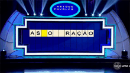
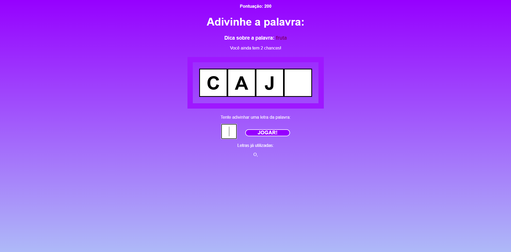

  <h1>Projeto Palavra secreta</h1> 
  
  
Projeto desenvolvido para aprimorar habilidades em desenvolvimento front-end utilizando ReactJS.

---

## Sobre o Projeto

Este projeto é um jogo de adivinhação da palavra. Nele possuímos 3 chances para acertar as letras corretas. Cada rodada acumulamos mais pontos para podermos competir com um amigo sobre quem faz a maior pontuação. Foi criado com o objetivo de praticar e demonstrar conhecimentos em tecnologias front-end, com foco em aprimorar meus conhecimentos em ReactJS.

---

## Tecnologias Utilizadas

- **HTML5** – estrutura da página
- **CSS3** – estilização personalizada
- **React** - Framework utilizado para dividir funcionalidades em componentes.
- **JS** – Back-end.

---

## Preview

